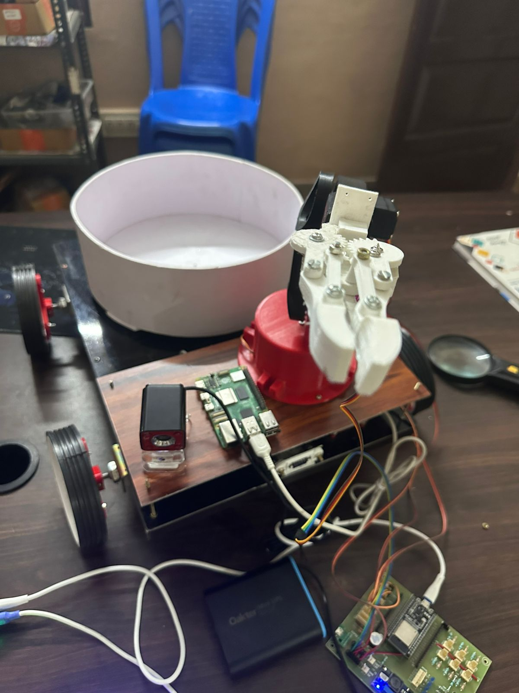
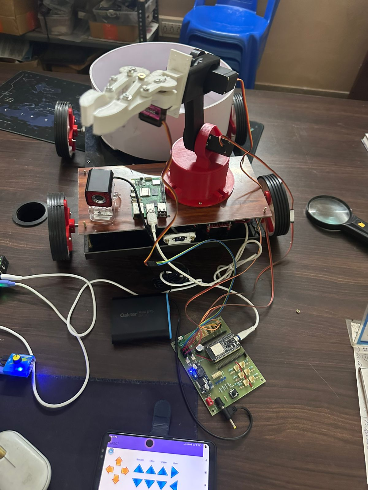
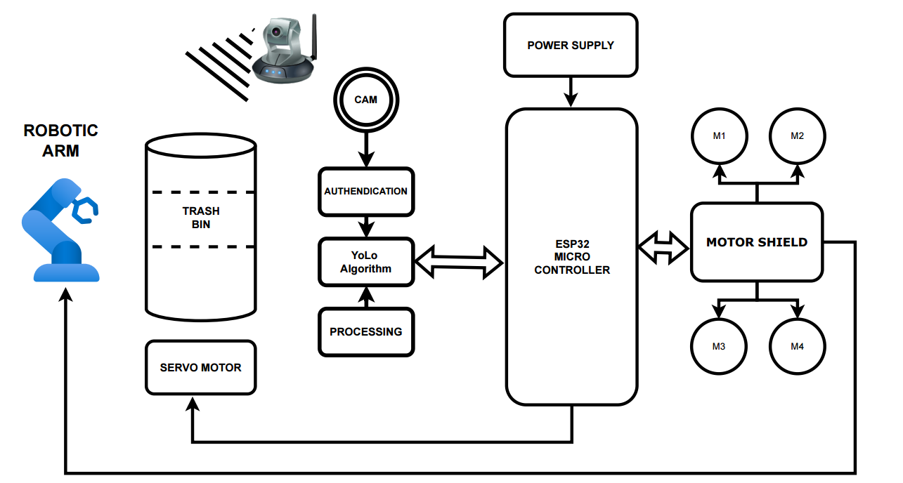
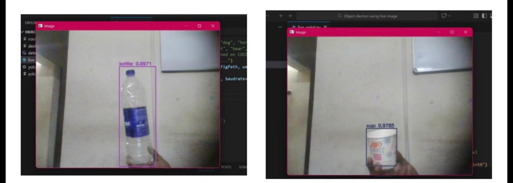
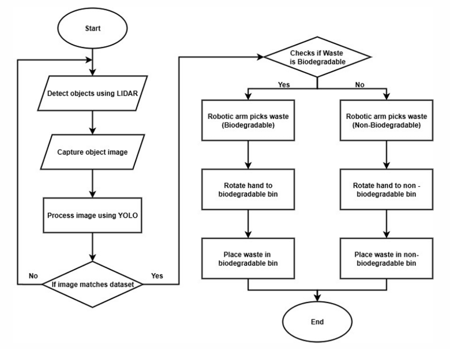

# ♻️ TrashBot
### AI-Powered Intelligent Waste Collection & Segregation Robot

<p align="center">


</p>

---

## 📖 Overview

**TrashBot** is an AI-powered autonomous waste collection and segregation robot designed to automate indoor waste management using Computer Vision, Robotics, and Embedded Systems.

The robot navigates autonomously, detects waste objects using **YOLOv8**, classifies them into biodegradable or non-biodegradable categories, and picks them using a robotic arm before placing them into the appropriate waste bin.

---

## 🚀 Features

- 🤖 Autonomous Indoor Navigation
- 👁️ Real-Time Waste Detection
- 🧠 YOLOv8 AI Object Detection
- ♻️ Intelligent Waste Segregation
- 🦾 Servo-Based Robotic Arm
- 📷 Raspberry Pi Camera Integration
- ⚙️ ESP32 Embedded Controller
- 🌐 Flask Web Dashboard
- 🔋 Portable Battery Powered

---

# 📷 Project Images

## TrashBot



---

## Robotic Arm



---

## Block Diagram



---

## Dashboard



---

## Flowchart



---

## Demo Video

The project demonstration video is available inside the **images** folder.

```
images/trashbot_demo.mp4
```

---

# 🏗️ System Architecture

```
                   Raspberry Pi 5
                         │
         ┌───────────────┼───────────────┐
         │               │               │
     Pi Camera        LiDAR Sensor   Flask Dashboard
         │
         ▼
   YOLOv8 Object Detection
         │
Waste Classification
         │
ESP32 Controller
         │
Motor Driver
         │
Robotic Arm
         │
Waste Bin
```

---

# 🛠 Hardware Used

- Raspberry Pi 5
- ESP32
- Raspberry Pi Camera
- LiDAR / ToF Sensor
- L298N Motor Driver
- MG996R Servo Motors
- DC Gear Motors
- Li-ion Battery
- Buck Converter
- 3D Printed Robotic Arm

---

# 💻 Software Stack

- Python
- OpenCV
- YOLOv8
- Flask
- Embedded C
- Arduino IDE
- Git
- GitHub

---

# 📂 Repository Structure

```
TrashBot/
│
├── docs/
│   ├── Project_Report.pdf
│   └── README.md
│
├── images/
│   ├── dashboard.jpeg
│   ├── robot_bin.jpeg
│   ├── robot_structure.jpeg
│   ├── robotic_arm.jpeg
│   ├── flowchart.png
│   ├── trashbot_demo.mp4
│   └── README.md
│
├── raspberry_pi/
│   ├── config/
│   │     ├── coco.names
│   │     └── yolov3.cfg
│   │
│   ├── live_serial.py
│   ├── segregation_yolo_v8.py
│   ├── waste_segregation.py
│   └── README.md
│
├── esp32/
│   ├── robotic_arm.ino
│   ├── waste_segregation.ino
│   └── README.md
│
├── flask_dashboard/
│   ├── app.py
│   ├── index.html
│   └── README.md
│
├── requirements.txt
├── LICENSE
└── README.md
```

---

# ⚙️ Installation

Clone the repository

```bash
git clone https://github.com/nivedrajeeshvp/TrashBot.git
```

Move into the project

```bash
cd TrashBot
```

Install Python dependencies

```bash
pip install -r requirements.txt
```

Run the Flask Dashboard

```bash
python flask_dashboard/app.py
```

Run Waste Detection

```bash
python raspberry_pi/waste_segregation.py
```

---

# 🔄 Workflow

1. Robot patrols autonomously.
2. LiDAR detects nearby objects.
3. Camera captures image.
4. YOLOv8 identifies waste.
5. ESP32 controls robotic arm.
6. Waste is picked.
7. Waste is placed into the correct bin.
8. Dashboard updates the waste count.

---

# 📈 Future Improvements

- Outdoor autonomous navigation
- GPS integration
- Cloud monitoring
- Mobile Application
- Smart City Integration
- Multi-Robot Collaboration

---

# 📚 Documentation

Complete project documentation is available here:

```
docs/Project_Report.pdf
```

---

# 👨‍💻 Team

Government Engineering College Barton Hill

Department of Electronics and Communication Engineering

- Archita R
- Hari Nanda B
- Nived Rajeesh V P
- Yadhuna V S

---

# 📄 License

This project is licensed under the MIT License.

---

## ⭐ Support

If you found this project useful,

⭐ Star this repository.

It helps others discover the project and supports future development.
